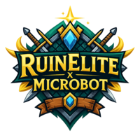

<p align="center">
  
</p>

<!-- TODO: Clean up / refactor -->


**RuinElite x Microbot** is my personal fork of the [Microbot](https://github.com/microbot-rs/microbot) project — a RuneLite-based automation framework for Old School RuneScape.  
The goal is to keep it **up-to-date** with Microbot while adding my own twist through custom scripts, plugins, UI changes, and unique features.

---

<div align="center">

<!-- BADGE:START -->

<!-- BADGE:END -->


</div>

---

## 🚀 Features & Goals
- **Custom scripts/plugins** written from scratch
- **UI customization** — custom launcher, splash screen, plugin panels, and more
- **Code improvements** — bug fixes, optimizations, and QoL changes
- **Ironman Mode** support:
    1. Make all scripts Ironman-friendly
    2. Long-term: Full automation following [ironman.guide](https://www.ironman.guide) to reach a maxed account

---

## 📌 Version Sync
<!-- SYNC:START -->
| Component | Version | Status |
|---|---|---|
| **RuinElite** | `1.0.0` |  |
| **Microbot** (upstream) | `1.9.8` |  |
<!-- SYNC:END -->

<!--  -->

---

## 🛠 How to Set Up

### 1️⃣ Prerequisites
Make sure you have installed:
- [Java 17 or higher](https://adoptium.net/) (LTS recommended)
- [Maven](https://maven.apache.org/download.cgi)
- [Git](https://git-scm.com/)

---

### 2️⃣ Clone the Repository
```sh
git clone https://github.com/YOUR_USERNAME/ruinelite-microbot.git
cd ruinelite-microbot
```

---

### 3️⃣ Build the Client
```sh
mvn clean install
```

---

### 4️⃣ Run the Client
Run from command line:
```sh
java -jar runelite-client/target/microbot-*.jar
```

Or run from your IDE (IntelliJ IDEA recommended) using the `RuneLite` main class.

---

## ⚠️ Disclaimer
This is a **personal educational project**. **RuinElite** do NOT replace **Microbot** in any way!

**Old School RuneScape** automation is against **Jagex’s** terms of service.  
Use at your own risk.

---